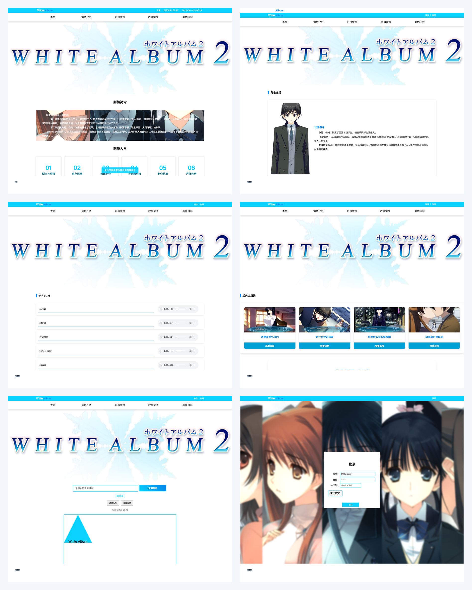
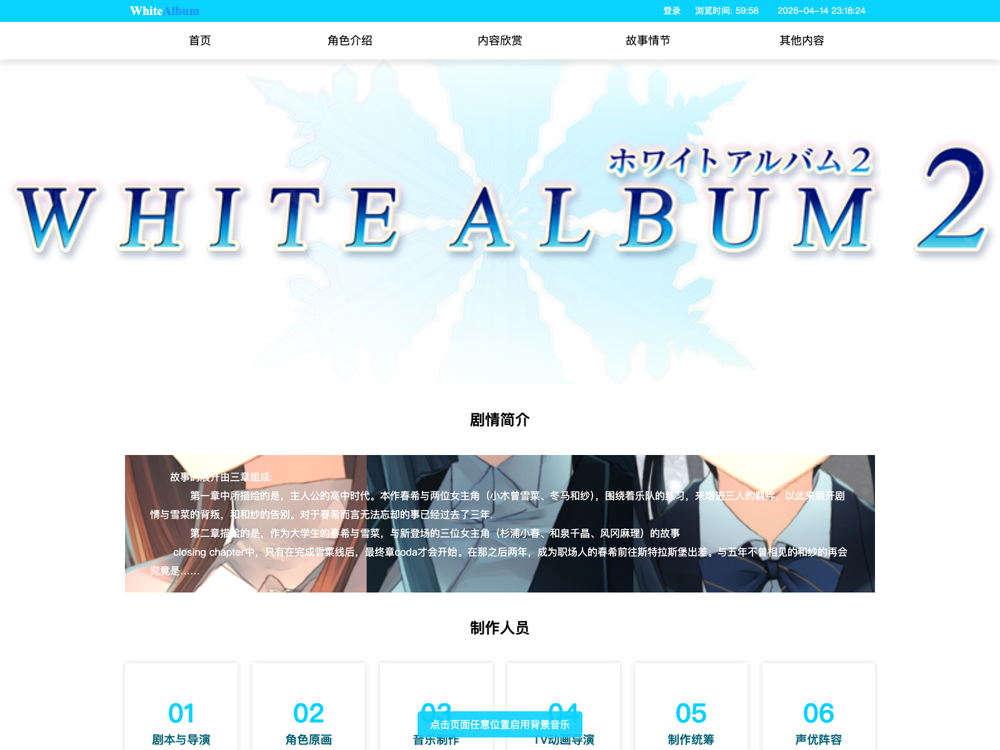
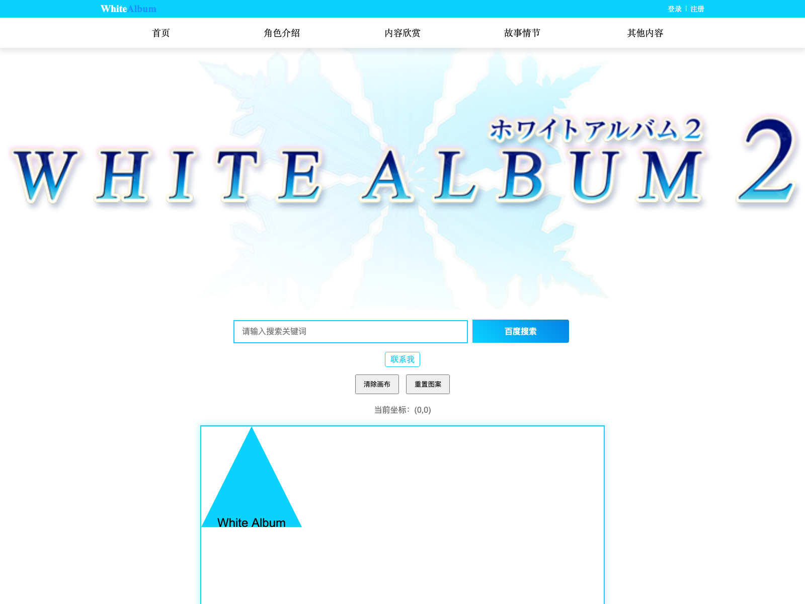
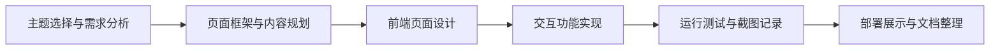
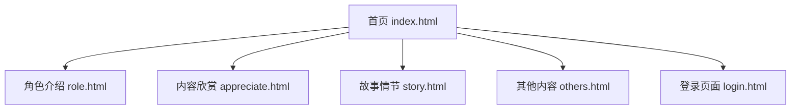

<div align="center">
  
  <h1>白色相簿2主题网站</h1>
  <p>一个围绕《WHITE ALBUM 2》角色、剧情、音乐与衍生内容制作的专题网站</p>
  <p>
    <a href="https://gzy2520.github.io/white-album2-website/">在线预览</a> |
    <a href="./开发文档.pdf">开发文档 PDF</a>
  </p>
</div>

## 项目简介

本项目是一个以《白色相簿2》为主题的课程网页作品，目标是为同好提供一个集角色介绍、剧情梳理、音乐视频欣赏、小说 PDF 阅读以及互动功能于一体的综合站点。

README 内容综合了仓库源码与 [开发文档 PDF](./开发文档.pdf) 中的需求分析、页面设计、功能设计和运行测试结果，方便直接了解项目结构与实现思路。

## 页面预览

<p align="center">
  
</p>

<table>
  <tr>
    <td width="50%" align="center">
      
      <p><strong>首页</strong></p>
    </td>
    <td width="50%" align="center">
      
      <p><strong>综合功能页</strong></p>
    </td>
  </tr>
</table>

## 核心内容

- `index.html`
  首页包含站点标题、剧情简介、制作人员信息、TV 片头视频、同人图区，以及欢迎弹窗、离开提示、动态时钟、浏览计时、鼠标轨迹、背景音乐提示等交互。
- `role.html`
  通过人物立绘与文字卡片展示北原春希、小木曾雪菜、冬马和纱等主要角色，支持点击卡片高亮与 `Esc` 复位。
- `appreciate.html`
  汇总经典 BGM、路线 OP/ED、CG 轮播图与官方/同人补充小说 PDF，适合作为作品资源入口页。
- `story.html`
  结合经典名场景跳转链接与剧情时间线，展示从 IC 到 Coda 的主要事件脉络。
- `others.html`
  集成百度搜索、邮箱联系、Canvas 绘图、Entrez 文献检索、百度地图定位等综合功能。
- `login.html`
  使用 `sessionStorage` 维护简单登录态，内置图形验证码，用于演示登录/注销交互流程。

## 开发流程

根据开发文档，本项目的整体流程可以概括为：



页面结构上，网站以多页面形式组织内容：



## 技术栈

- `HTML5`
- `CSS3`
- `JavaScript`
- `PHP 8.2`
- `jQuery`
- `sessionStorage`
- `Baidu Map API`
- `NCBI Entrez API`

## 目录结构

```text
white-album2-website/
├── index.html
├── role.html
├── appreciate.html
├── story.html
├── others.html
├── login.html
├── register.html
├── css/
├── js/
├── image/
├── music/
├── video/
├── pdf/
├── Entrez_do.php
├── entrez_get.php
├── entrez_post.php
├── entrez_session.php
├── entrez_session2.php
├── 开发文档.pdf
└── docs/readme/
```

## 本地运行

### 方式一：使用 XAMPP / Apache

1. 将项目放入 `htdocs` 目录。
2. 启动 Apache。
3. 浏览器访问 `http://localhost/white-album2-website/index.html`。

### 方式二：使用 PHP 内置服务器

```bash
cd white-album2-website
php -S 127.0.0.1:8000
```

然后访问：

```text
http://127.0.0.1:8000/index.html
```

## 演示账号

- 账号：`2330416033`
- 密码：`password`
- 说明：登录页会随机生成 4 位图形验证码，输入正确后写入 `sessionStorage` 并跳回首页。

## 功能说明与注意事项

- GitHub Pages 适合展示静态页面、图片、音视频与基础前端交互。
- `Entrez` 检索依赖 PHP 接口文件，完整体验建议在本地 Apache / PHP 环境下运行。
- 百度地图功能依赖网络、浏览器定位权限以及对应 API 服务状态。
- 当前登录系统主要用于课程项目演示，不是生产级身份验证方案。

## 文档说明

- 详细设计、测试截图与功能说明见：[开发文档.pdf](./开发文档.pdf)
- README 中的页面预览图位于：[`docs/readme/`](./docs/readme/)

